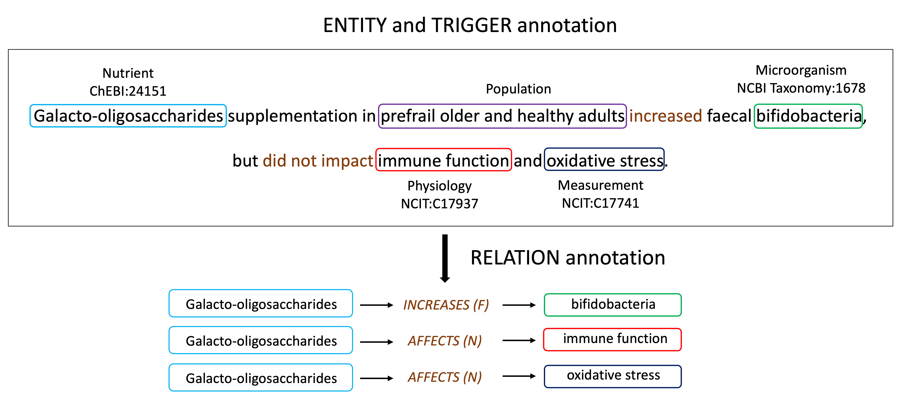

# DiMB-RE: Mining the Scientific Literature for Diet-Microbiome Associations

This repository contains (PyTorch) code, dataset, and fine-tuned models for DiMB-RE (**Di**et-**M**icro**B**iome dataset for **R**elation **E**xtraction).

## Quick links
- [DiMB-RE: Mining the Scientific Literature for Diet-Microbiome Associations](#dimb-re-mining-the-scientific-literature-for-diet-microbiome-associations)
  - [Quick links](#quick-links)
  - [Overview](#overview)
  - [1. Reproducibility Check](#1-reproducibility-check)
  - [2. Setup](#2-setup)
    - [Install dependencies](#install-dependencies)
  - [3. Training Relation Model (Under construction):](#3-training-relation-model-under-construction)
    - [Input data format for the relation model](#input-data-format-for-the-relation-model)
    - [Train/evaluate the relation model (Under construction):](#trainevaluate-the-relation-model-under-construction)
  - [Fine-tuned Models](#fine-tuned-models)

## Overview

In this work, we annotate new benchmark corpus for entity and relation extraction, as well as factuality detection with diet-microbiome related entities. Our contributions are as follow:

1. We present the first diverse, multi-layered, publicly available corpus that focuses on diet and microbiome interactions in the scientific literature.
2. We present comprehensive NLP experiments based on state-of-the-art pretrained language models to establish baselines on this corpus.
3. We present a detailed error analysis of NLP results to identify challenges and improvement areas.

<!-- Please find more details of this work in our [paper](https://arxiv.org/pdf/2010.12812.pdf). -->

## 1. Reproducibility Check
<!-- ## Quick Start -->

For simple reproducibility check, you can run this [Colab Notebook](https://colab.research.google.com/drive/1abCEYlFOCmu7yO7TQQeHOwVPCDX8H4Rs?usp=sharing) which is to generate predictions and evaluate them for RE and Factuality Detection task.

The final end-to-end result should match with the following scores, which are the best performance of PURE-based RE models from our paper.

```plaintext
NER - P: 0.772500, R: 0.747900, F1: 0.760000
NER Relaxed - P: 0.847500, R: 0.794900, F1: 0.820400
TRG - P: 0.708300, R: 0.627700, F1: 0.665600
TRG Relaxed - P: 0.756900, R: 0.670800, F1: 0.711300
REL Relaxed - P: 0.460000, R: 0.377000, F1: 0.414400
REL Strict - P: 0.416500, R: 0.341300, F1: 0.375200
REL Relaxed+Factuality - P: 0.445500, R: 0.365100, F1: 0.401300
REL Strict+Factuality - P: 0.401900, R: 0.329400, F1: 0.362100

```

If you want to run check reproducibility in your own environment, first you need to follow the instructions in [2. Setup](#2-setup). And then, all you need to do is to run the bash command below.

```bash

# Run the fine-tuned relation model
bash check_reproducibility.sh

```

## 2. Setup

### Install dependencies
Please install all the dependency packages using the following command:
```
conda create -n DiMB-RE python=3.8
conda activate DiMB-RE
conda install --file requirements.txt
```

*Note*: We modified and utilized the existing codes from [PURE](https://github.com/princeton-nlp/PURE) as a baseline, while employing the preprocessing scripts from [DeepEventMine](https://github.com/aistairc/DeepEventMine/tree/master/scripts).

<!-- ### Download and preprocess the datasets
Our experiments are based on three datasets: ACE04, ACE05, and SciERC. Please find the links and pre-processing below:
* ACE04/ACE05: We use the preprocessing code from [DyGIE repo](https://github.com/luanyi/DyGIE/tree/master/preprocessing). Please follow the instructions to preprocess the ACE05 and ACE04 datasets.
* SciERC: The preprocessed SciERC dataset can be downloaded in their project [website](http://nlp.cs.washington.edu/sciIE/). -->


<!-- ## Entity Model

### Input data format for the entity model

The input data format of the entity model is JSONL. Each line of the input file contains one document in the following format.
```
{
  # document ID (please make sure doc_key can be used to identify a certain document)
  "doc_key": "CNN_ENG_20030306_083604.6",

  # sentences in the document, each sentence is a list of tokens
  "sentences": [
    [...],
    [...],
    ["tens", "of", "thousands", "of", "college", ...],
    ...
  ],

  # entities (boundaries and entity type) in each sentence
  "ner": [
    [...],
    [...],
    [[26, 26, "LOC"], [14, 14, "PER"], ...], #the boundary positions are indexed in the document level
    ...,
  ],

  # relations (two spans and relation type) in each sentence
  "relations": [
    [...],
    [...],
    [[14, 14, 10, 10, "ORG-AFF"], [14, 14, 12, 13, "ORG-AFF"], ...],
    ...
  ]
}
```

### Train/evaluate the entity model

You can use `run_entity.py` with `--do_train` to train an entity model and with `--do_eval` to evaluate an entity model.
A trianing command template is as follow:
```bash
python run_entity.py \
    --do_train --do_eval [--eval_test] \
    --learning_rate=1e-5 --task_learning_rate=5e-4 \
    --train_batch_size=16 \
    --context_window {0 | 100 | 300} \
    --task {ace05 | ace04 | scierc} \
    --data_dir {directory of preprocessed dataset} \
    --model {bert-base-uncased | albert-xxlarge-v1 | allenai/scibert_scivocab_uncased} \
    --output_dir {directory of output files}
```
Arguments:
* `--learning_rate`: the learning rate for BERT encoder parameters.
* `--task_learning_rate`: the learning rate for task-specific parameters, i.e., the classifier head after the encoder.
* `--context_window`: the context window size used in the model. `0` means using no contexts. In our cross-sentence entity experiments, we use `--context_window 300` for BERT models and SciBERT models and use `--context_window 100` for ALBERT models.
* `--model`: the base transformer model. We use `bert-base-uncased` and `albert-xxlarge-v1` for ACE04/ACE05 and use `allenai/scibert_scivocab_uncased` for SciERC.
* `--eval_test`: whether evaluate on the test set or not.

The predictions of the entity model will be saved as a file (`ent_pred_dev.json`) in the `output_dir` directory. If you set `--eval_test`, the predictions (`ent_pred_test.json`) are on the test set. The prediction file of the entity model will be the input file of the relation model. -->

## 3. Training Relation Model (Under construction):
### Input data format for the relation model
The input data format of the relation model is almost the same as that of the entity model, except that there is one more filed `."predicted_ner"` to store the predictions of the entity model.
```bash
{
  "doc_key": "CNN_ENG_20030306_083604.6",
  "sentences": [...],
  "ner": [...],
  "relations": [...],
  "predicted_ner": [
    [...],
    [...],
    [[26, 26, "LOC"], [14, 15, "PER"], ...],
    ...
  ]
}
```

### Train/evaluate the relation model (Under construction):
You can use `run_relation.py` with `--do_train` to train a relation model and with `--do_eval` to evaluate a relation model. A trianing command template is as follow:
```bash
python run_relation.py \
  --task {ace05 | ace04 | scierc} \
  --do_train --train_file {path to the training json file of the dataset} \
  --do_eval [--eval_test] [--eval_with_gold] \
  --model {bert-base-uncased | albert-xxlarge-v1 | allenai/scibert_scivocab_uncased} \
  --do_lower_case \
  --train_batch_size 32 \
  --eval_batch_size 32 \
  --learning_rate 2e-5 \
  --num_train_epochs 10 \
  --context_window {0 | 100} \
  --max_seq_length {128 | 228} \
  --entity_output_dir {path to output files of the entity model} \
  --output_dir {directory of output files}
```
Arguments:
* `--eval_with_gold`: whether evaluate the model with the gold entities provided.
* `--entity_output_dir`: the output directory of the entity model. The prediction files (`ent_pred_dev.json` or `ent_pred_test.json`) of the entity model should be in this directory.

The prediction results will be stored in the file `predictions.json` in the folder `output_dir`, and the format will be almost the same with the output file from the entity model, except that there is one more field `"predicted_relations"` for each document.

You can run the evaluation script to output the end-to-end performance  (`Ent`, `Rel`, and `Rel+`) of the predictions.
```bash
python run_eval.py --prediction_file {path to output_dir}/predictions.json
```

*Note*: Training/evaluation performance might be slightly different from the reported numbers in the paper, depending on the number of GPUs, batch size, and so on.

<!-- ### Approximation relation model
You can use the following command to train an approximation model.
```bash
python run_relation_approx.py \
 --task {ace05 | ace04 | scierc} \
 --do_train --train_file {path to the training json file of the dataset} \
 --do_eval [--eval_with_gold] \
 --model {bert-base-uncased | allenai/scibert_scivocab_uncased} \
 --do_lower_case \
 --train_batch_size 32 \
 --eval_batch_size 32 \
 --learning_rate 2e-5 \
 --num_train_epochs 10 \
 --context_window {0 | 100} \
 --max_seq_length {128 | 228} \
 --entity_output_dir {path to output files of the entity model} \
 --output_dir {directory of output files}
```

Once you have a trained approximation model, you can enable efficient batch computation during inference with `--batch_computation`:
```bash
python run_relation_approx.py \
 --task {ace05 | ace04 | scierc} \
 --do_eval [--eval_test] [--eval_with_gold] \
 --model {bert-base-uncased | allenai/scibert_scivocab_uncased} \
 --do_lower_case \
 --eval_batch_size 32 \
 --context_window {0 | 100} \
 --max_seq_length 250 \
 --entity_output_dir {path to output files of the entity model} \
 --output_dir {directory of output files} \
 --batch_computation
```
*Note*: the current code does not support approximation models based on ALBERT. -->

## Fine-tuned Models
We release our fine-tuned entity/trigger models, relation models, and factuality detection models for our dataset.


<!-- ### Pre-trained models for ACE05
**Entity models**:
* [BERT (single, W=0)](https://nlp.cs.princeton.edu/projects/pure/ace05_models/ent-bert-ctx0.zip) (388M): Single-sentence entity model based on `bert-base-uncased`
* [ALBERT (single, W=0)](https://nlp.cs.princeton.edu/projects/pure/ace05_models/ent-alb-ctx0.zip) (793M): Single-sentence entity model based on `albert-xxlarge-v1`
* [BERT (cross, W=300)](https://nlp.cs.princeton.edu/projects/pure/ace05_models/ent-bert-ctx300.zip) (388M): Cross-sentence entity model based on `bert-base-uncased`
* [ALBERT (cross, W=100)](https://nlp.cs.princeton.edu/projects/pure/ace05_models/ent-alb-ctx100.zip) (793M): Cross-sentence entity model based on `albert-xxlarge-v1`

**Relation models**:
* [BERT (single, W=0)](https://nlp.cs.princeton.edu/projects/pure/ace05_models/rel-bert-ctx0.zip) (387M): Single-sentence relation model based on `bert-base-uncased`
* [BERT-approx (single, W=0)](https://nlp.cs.princeton.edu/projects/pure/ace05_models/rel_approx-bert-ctx0.zip) (387M): Single-sentence approximation relation model based on `bert-base-uncased`
* [ALBERT (single, W=0)](https://nlp.cs.princeton.edu/projects/pure/ace05_models/rel-alb-ctx0.zip) (789M): Single-sentence relation model based on `albert-xxlarge-v1`
* [BERT (cross, W=100)](https://nlp.cs.princeton.edu/projects/pure/ace05_models/rel-bert-ctx100.zip) (387M): Cross-sentence relation model based on `bert-base-uncased`
* [BERT-approx (cross, W=100)](https://nlp.cs.princeton.edu/projects/pure/ace05_models/rel_approx-bert-ctx100.zip) (387M): Crosss-sentence approximation relation model based on `bert-base-uncased`
* [ALBERT (cross, W=100)](https://nlp.cs.princeton.edu/projects/pure/ace05_models/rel-alb-ctx100.zip) (789M): Cross-sentence relation model based on `albert-xxlarge-v1` -->

**Performance of pretrained models on DiMB-RE test set**:
* BiomedBERT-abstract-fulltext
```
NER - P: 0.890260, R: 0.882944, F1: 0.886587
REL - P: 0.689624, R: 0.652476, F1: 0.670536
REL (strict) - P: 0.664830, R: 0.629018, F1: 0.646429
```
<!-- * BERT-approx (single)
```
NER - P: 0.890260, R: 0.882944, F1: 0.886587
REL - P: 0.678899, R: 0.642919, F1: 0.660419
REL (strict) - P: 0.651376, R: 0.616855, F1: 0.633646
```
* ALBERT (single)
```
NER - P: 0.900237, R: 0.901388, F1: 0.900812
REL - P: 0.739901, R: 0.652476, F1: 0.693444
REL (strict) - P: 0.698522, R: 0.615986, F1: 0.654663
```
* BERT (cross)
```
NER - P: 0.902111, R: 0.905405, F1: 0.903755
REL - P: 0.701950, R: 0.656820, F1: 0.678636
REL (strict) - P: 0.668524, R: 0.625543, F1: 0.646320
```
* BERT-approx (cross)
```
NER - P: 0.902111, R: 0.905405, F1: 0.903755
REL - P: 0.684448, R: 0.657689, F1: 0.670802
REL (strict) - P: 0.659132, R: 0.633362, F1: 0.645990
```
* ALBERT (cross)
```
NER - P: 0.911111, R: 0.905953, F1: 0.908525
REL - P: 0.748521, R: 0.659427, F1: 0.701155
REL (strict) - P: 0.723866, R: 0.637706, F1: 0.678060
``` -->

<!-- ## Bugs or Questions?
If you have any questions related to the code or the paper, feel free to email Zexuan Zhong `(zzhong@cs.princeton.edu)`. If you encounter any problems when using the code, or want to report a bug, you can open an issue. Please try to specify the problem with details so we can help you better and quicker!

## Citation
If you use our code in your research, please cite our work:
```bibtex
@inproceedings{zhong2021frustratingly,
   title={A Frustratingly Easy Approach for Entity and Relation Extraction},
   author={Zhong, Zexuan and Chen, Danqi},
   booktitle={North American Association for Computational Linguistics (NAACL)},
   year={2021}
} -->
```
